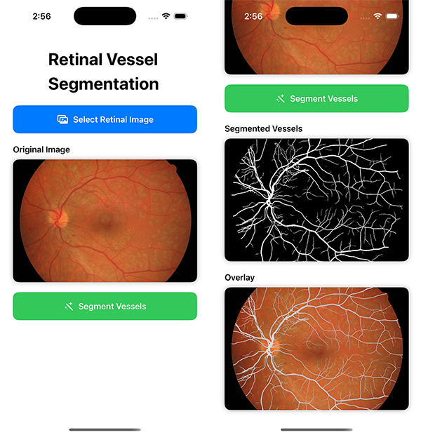

# RetinalVesselSegDemo

An iOS demo application that performs automated retinal vessel segmentation using Core ML. This app leverages deep learning to identify and extract blood vessels from retinal fundus images, providing both binary masks and overlay visualizations.

## 📋 Project Description

Retinal vessel segmentation is a critical task in medical image analysis, particularly for diagnosing and monitoring eye diseases such as diabetic retinopathy, glaucoma, and hypertension. This application provides an on-device solution for segmenting retinal vessels from fundus images using a pre-trained Core ML model (`VesselSegmenter`).

The application intelligently handles images of various sizes:
- **Small images (≤ 384×384)**: Processed directly in a single pass
- **Large images (> 384×384)**: Processed using a sophisticated patch-wise approach with overlap blending to ensure seamless results

## ✨ Features

- **On-Device Processing**: All segmentation runs locally using Core ML, ensuring privacy and offline capability
- **Adaptive Processing**: Automatically selects single-image or patch-wise segmentation based on image size
- **High-Quality Results**: Patch-wise processing with overlap blending eliminates artifacts at patch boundaries
- **Multiple Visualizations**: 
  - Original retinal image
  - Binary vessel mask (segmented vessels)
  - Overlay view (mask applied to original image)
- **Modern UI**: SwiftUI-based interface with intuitive image picker and real-time processing feedback
- **Error Handling**: Comprehensive error handling with user-friendly messages

## 📸 Screenshots


*Retinal vessel segmentation demo showing original image selection, segmented vessels mask, and overlay visualization*

## 🏗️ Technical Architecture

### Core Components

1. **SegmentationViewModel** (`SegmentationViewModel.swift`)
   - Main business logic and state management
   - Handles model loading, image processing, and segmentation orchestration
   - Manages patch-wise processing with overlap blending

2. **MainView** (`MainView.swift`)
   - SwiftUI user interface
   - Image selection via PhotosPicker
   - Displays original, segmented, and overlay images

3. **VesselSegmenter Model** (`mlmodel/VesselSegmenter.mlpackage`)
   - Pre-trained Core ML model for vessel segmentation
   - Accepts 1×3×384×384 input (batch, channels, height, width)
   - Outputs 1×1×H×W probability maps

## 🤖 ML Model Details

### Model: VesselSegmenter

- **Input Format**: 
  - Shape: `[1, 3, 384, 384]` (Channel-First layout)
  - Data Type: `Float32`
  - Normalization: Pixel values normalized to [0, 1] range
  - Color Space: Linear RGB (converted from sRGB)
  - Channel Strategy: Green channel from input image is replicated across all three RGB channels

- **Output Format**:
  - Shape: `[1, 1, H, W]` (probability map)
  - Data Type: `Float32`
  - Values: Probability scores [0.0, 1.0] for each pixel
  - Threshold: 0.5 (default) for binary mask conversion

- **Model Configuration**:
  - Compute Units: `.all` (utilizes CPU, GPU, and Neural Engine when available)
  - Target Size: 384×384 pixels

### Why Green Channel?

Retinal fundus images typically have the highest contrast in the green channel for vessel structures. By using the green channel value across all three input channels, the model receives the most informative signal while maintaining the expected 3-channel input format.

## 🔧 Technical Implementation Phases

### Phase 1: Image Loading & Preprocessing

1. **Image Selection**: User selects a retinal image via PhotosPicker
2. **Image Loading**: UIImage is loaded and stored in the view model
3. **Size Detection**: System determines if patch-wise processing is needed

### Phase 2: Input Preparation

1. **Color Space Conversion**: 
   - UIImage (sRGB) → Linear RGB via Core Graphics
   - Ensures accurate color representation for the model

2. **Image Resizing**:
   - Small images: Resized to 384×384
   - Large images: Processed in patches (see Phase 3)

3. **Channel Extraction**:
   - Green channel extracted from the image
   - Replicated across R, G, B channels for model input

4. **MLMultiArray Conversion**:
   - Image → CVPixelBuffer → MLMultiArray
   - Format: `[1, 3, H, W]` with Float32 values normalized to [0, 1]

### Phase 3: Segmentation Processing

#### Single Image Path (≤ 384×384)
1. Direct resizing to 384×384
2. Conversion to MLMultiArray
3. Single model prediction
4. Output extraction and mask generation

#### Patch-Wise Path (> 384×384)
1. **Patch Generation**:
   - Patch size: 384×384 pixels
   - Overlap: 64 pixels between adjacent patches
   - Step size: 320 pixels (384 - 64)
   - Patches cover the entire image with overlap

2. **Patch Processing**:
   - Each patch is cropped from the original image
   - Padded to 384×384 if smaller (edge patches)
   - Processed through the model independently
   - Results stored in accumulation arrays

3. **Overlap Blending**:
   - **Sum Array**: Accumulates probability values from all overlapping patches
   - **Count Array**: Tracks how many patches contributed to each pixel
   - **Averaging**: Final probability = Sum / Count
   - Eliminates boundary artifacts and ensures smooth transitions

4. **Stitching**:
   - Only valid (non-padded) regions from each patch are blended
   - Final mask reconstructed from averaged probabilities

### Phase 4: Post-Processing

1. **Probability to Binary Conversion**:
   - Threshold: 0.5 (configurable)
   - Values > 0.5 → White (255)
   - Values ≤ 0.5 → Black (0)

2. **Mask Image Generation**:
   - MLMultiArray → CVPixelBuffer → UIImage
   - Grayscale binary mask

3. **Overlay Creation**:
   - Mask applied as alpha channel to original image
   - Creates visual overlay showing segmented vessels

### Phase 5: UI Update

1. Results displayed in SwiftUI views
2. Error messages shown if processing fails
3. Processing state managed for user feedback

## 🔬 Technical Details

### Patch-Wise Processing Algorithm

```swift
// Key parameters
patchSize = 384
overlap = 64
step = patchSize - overlap = 320

// Processing loop
for each row (startY = 0; startY < height; startY += step):
    for each column (startX = 0; startX < width; startX += step):
        1. Crop patch at (startX, startY)
        2. Pad to 384×384 if needed
        3. Run model prediction
        4. Blend output into accumulation arrays
```

### Blending Strategy

The overlap blending uses **averaging** to combine predictions:
- Each pixel in overlapping regions receives contributions from multiple patches
- Final probability = average of all contributing patches
- This approach:
  - Reduces boundary artifacts
  - Improves accuracy at patch edges
  - Ensures consistent results across the entire image

### Memory Management

- Uses `autoreleasepool` for patch processing to manage memory efficiently
- Background processing via `Task.detached` to keep UI responsive
- Proper cleanup of Core ML resources and pixel buffers

### Color Space Handling

- **Input**: sRGB (standard for UIImage)
- **Processing**: Linear RGB (required for accurate model inference)
- **Conversion**: Automatic via Core Graphics when drawing into Linear RGB context

## 📱 Usage

1. **Launch the App**: Open RetinalVesselSegDemo on your iOS device
2. **Select Image**: Tap "Select Retinal Image" and choose a fundus image from your photo library
3. **Segment**: Tap "Segment Vessels" to process the image
4. **View Results**: 
   - Original image (top)
   - Segmented vessels mask (middle)
   - Overlay visualization (bottom)

## 🛠️ Requirements

- **iOS**: 15.0 or later
- **Xcode**: 14.0 or later
- **Swift**: 5.7 or later
- **Frameworks**:
  - SwiftUI
  - CoreML
  - Accelerate
  - CoreGraphics
  - CoreImage
  - CoreVideo
  - PhotosUI

## 📁 Project Structure

```
RetinalVesselSegDemo/
├── RetinalVesselSegDemo/
│   ├── RVSegmentationApp.swift          # App entry point
│   ├── MainView.swift                   # SwiftUI interface
│   ├── SegmentationViewModel.swift      # Core segmentation logic
│   └── mlmodel/
│       └── VesselSegmenter.mlpackage/   # Core ML model
├── images/
│   └── demo.png                         # App demo screenshot
└── README.md                            # This file
```

## 🔍 Error Handling

The application includes comprehensive error handling for:
- Model loading failures
- Image conversion errors
- Prediction failures
- Memory issues
- Invalid input images

All errors are surfaced to the user with descriptive messages via the `SegmentationError` enum.

## 🚀 Performance Considerations

- **On-Device Processing**: All computation happens locally for privacy and speed
- **Background Processing**: Heavy computation runs off the main thread
- **Efficient Memory Usage**: Patch-wise processing prevents memory overflow for large images
- **Optimized Blending**: Direct pointer manipulation for fast array operations

## 📝 Notes

- The model expects 384×384 input images
- Large images are automatically processed in patches
- Processing time depends on image size and device capabilities
- Results are thresholded at 0.5; this can be adjusted in `convertMultiArrayToMaskImage`

## 👤 Author

Created by Tapos Datta

---

**Note**: This application is for demonstration purposes. For clinical use, ensure proper validation and regulatory compliance.

